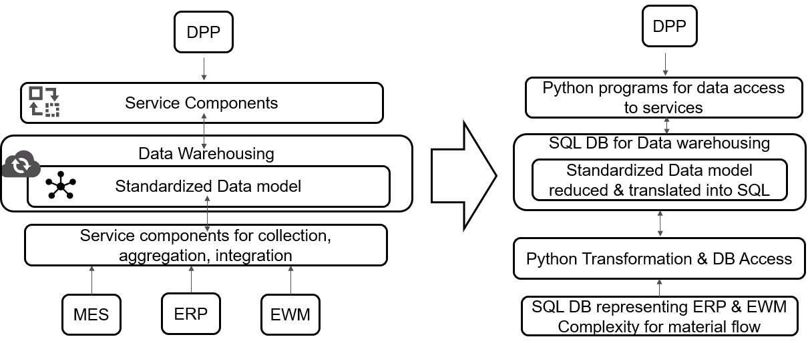
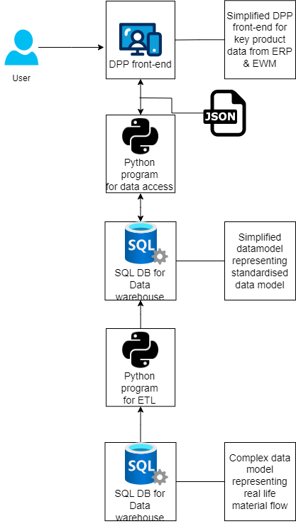

# Project Structure

This repository consists of 5 subfolders: 

1. 01_SQL: contains all sql scripts for both databases
2. 02_ETL: contains the python program for the ETL from the complex to the simplfified database
3. 03_DPP_Service: Contains two python programs for the DPP service
4. 04_AAS_DTDL_translation: contains a python script translating the SQL script of the simplified database schema into AAS like data  model
5. 05_Additional_Documents: contains pictures and additional materials

# Main Idea

# Initial set-up
### Packages needed: 
- pyodbc
- flask
- request

### Databse: 
Microsoft SQL Server  & SQL Server Management Studio where used for this project. 
Please be aware that using a different DBMS may require adjustment of the provided SQL scripts.

### ETL service
To execute the ETL jobs, please navigate to the folder 02_ETL

### DPP Service
To execute the DPP service, please naviaget to the folder 03_DPP_Service
